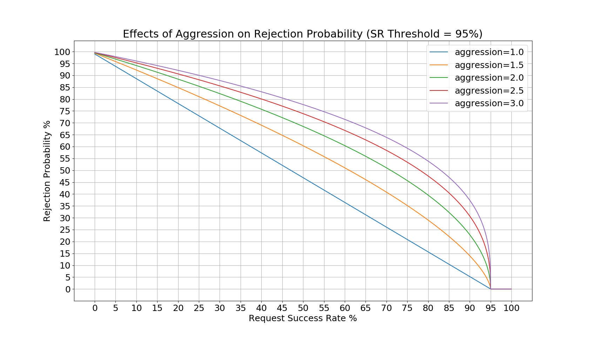

Admission Control {#config_http_filters_admission_control}
=================

::: {.attention}
::: {.title}
Attention
:::

The admission control filter is experimental and is currently under
active development.
:::

See the
`v3 API reference <envoy_v3_api_msg_extensions.filters.http.admission_control.v3alpha.AdmissionControl>`{.interpreted-text
role="ref"} for details on each configuration parameter.

Overview
--------

The admission control filter probabilistically rejects requests based on
the success rate of previous requests in a configurable sliding time
window. It is based on [client-side
throttling](https://landing.google.com/sre/sre-book/chapters/handling-overload/)
from the [Google SRE
handbook](https://landing.google.com/sre/sre-book/toc/index.html). The
only notable difference between the admission control filter\'s load
shedding and load shedding defined in client-side throttling is that
users may configure how aggressively load shedding starts at a target
request success rate. Users may also configure the definition of a
successful request for the purposes of the rejection probability
calculation.

The probability that the filter will reject a request is as follows:

$$P_{reject} = {(\frac{n_{total} - s}{n_{total} + 1})}^\frac{1}{aggression}$$

where,

$$s = \frac{n_{success}}{threshold}$$

-   *n* refers to a request count gathered in the sliding window.
-   *threshold* is a configurable value that dictates the lowest request
    success rate at which the filter will **not reject** requests. The
    value is normalized to \[0,1\] for the calculation.
-   *aggression* controls the rejection probability curve such that 1.0
    is a linear increase in rejection probability as the success rate
    decreases. As the **aggression** increases, the rejection
    probability will be higher for higher success rates. See
    [Aggression](#aggression) for a more detailed explanation.

::: {.note}
::: {.title}
Note
:::

The success rate calculations are performed on a per-thread basis for
increased performance. In addition, the per-thread isolation prevents
decreases the blast radius of a single bad connection with an anomalous
success rate. Therefore, the rejection probability may vary between
worker threads.
:::

::: {.note}
::: {.title}
Note
:::

Health check traffic does not count towards any of the filter\'s
measurements.
:::

See the `v3 API reference
<envoy_v3_api_msg_extensions.filters.http.admission_control.v3alpha.AdmissionControl>`{.interpreted-text
role="ref"} for more details on this parameter.

The definition of a successful request is a `configurable parameter
<envoy_v3_api_msg_extensions.filters.http.admission_control.v3alpha.AdmissionControl.SuccessCriteria>`{.interpreted-text
role="ref"} for both HTTP and gRPC requests.

### Aggression

The aggression value affects the rejection probabilities as shown in the
following figures:



Since the success rate threshold in the first figure is set to 95%, the
rejection probability remains 0 until then. In the second figure, there
rejection probability remains 0 until the success rate reaches 50%. In
both cases, as success rate drops to 0%, the rejection probability
approaches a value just under 100%. The aggression values dictate how
high the rejection probability will be at a given request success rate,
so it will shed load more *aggressively*.

Example Configuration
---------------------

An example filter configuration can be found below. Not all fields are
required and many of the fields can be overridden via runtime settings.

``` {.yaml}
name: envoy.filters.http.admission_control
typed_config:
  "@type": type.googleapis.com/envoy.extensions.filters.http.admission_control.v3alpha.AdmissionControl
  enabled:
    default_value: true
    runtime_key: "admission_control.enabled"
  sampling_window: 120s
  sr_threshold:
    default_value: 95.0
    runtime_key: "admission_control.sr_threshold"
  aggression:
    default_value: 1.5
    runtime_key: "admission_control.aggression"
  success_criteria:
    http_criteria:
      http_success_status:
        - start: 100
          end:   400
        - start: 404
          end:   404
    grpc_criteria:
      grpc_success_status:
        - 0
        - 1
```

The above configuration can be understood as follows:

-   Calculate the request success-rate over a 120s sliding window.
-   Do not begin shedding any load until the request success-rate drops
    below 95% in the sliding window.
-   HTTP requests are considered successful if they are 1xx, 2xx, 3xx,
    or a 404.
-   gRPC requests are considered successful if they are OK or CANCELLED.

Statistics
----------

The admission control filter outputs statistics in the
*http.\<stat_prefix\>.admission_control.* namespace. The `stat prefix
<envoy_v3_api_field_extensions.filters.network.http_connection_manager.v3.HttpConnectionManager.stat_prefix>`{.interpreted-text
role="ref"} comes from the owning HTTP connection manager.

  Name          Type      Description
  ------------- --------- ------------------------------------------------------
  rq_rejected   Counter   Total requests that were not admitted by the filter.
  rq_success    Counter   Total requests that were considered a success.
  rq_failure    Counter   Total requests that were considered a failure.
